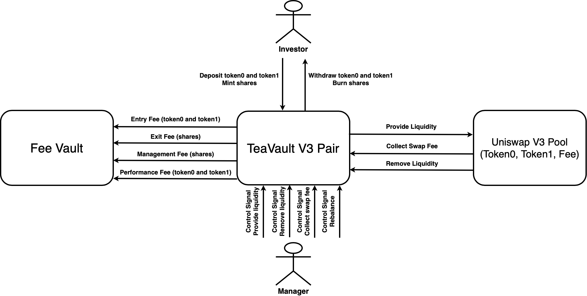

# TeaVault V3 Pair

TeaVault v3 pair (hereinafter simplified as TeaVault) is an infrastructure designed specifically for managing Uniswap v3 liquidity. Liquidity strategy managers can manage the funds through the vault, rebalance and choose the price range for providing liquidity. Our design makes the funds tokenized and more self-custodial for investers, enabling them to participate in or exit a strategy at any time. Since managers do not hold the funds directly, TeaVault v3 pair can make liquidity management more transparent while supporting automated management of large liquidity.

## Design



### Roles

#### TeaVault V3 Pair:

-   UUPS upgradable pattern.
-   Specify the Uniswap v3 pool while initializing.
-   Interacting with the Uniswap v3 pool.
-   Calculate protocol fees including entry, exit, management and performance fee.
-   Helper functions for frontend and strategy automation.

#### Fee Vault:

-   Collect protocol fees.
-   Entry fee: collect a ratio of token0 and token1 from inverstors' depositing.
-   Exit fee: collect a ratio of investors' shares before burning and withdrawing funds.
-   Management fee: collect by minting new shares while investors depositing and withdrawing. For example, the current status of the TeaVault is as follows.
    -   Total supply of share is $n$
    -   Management fee is $1.2\%/year$
    -   It has been one month since last collect management fee. ($0.1\%$ of management fee to be collected)
        then the TeaVault will mint $0.1n/(100-0.1)$ shares as management fee.
-   Performance fee: collect a ratio of collected swap fees (token0 and token1) from the Uniswap v3 pool.

#### Manager:

-   Send control signal to the managed TeaVault including providing/removing liquidity, rebalancing and collecting swap fees.
-   Support rebalancing TeaVault funds through the Uniswap v3 pool or 1inch router.

#### Investor:

-   Deposit funds based on the proportion of underlying assets in the vault and mint shares.
-   Withdraw funds from the vault by burning hold shares.

For example, the current status of the TeaVault is as follows.

-   Total supply of share is $n$
-   Holds underlying asset of 100 token0 and 130 token1
    -   70 token0
    -   40 token1
    -   1000 unit of liquidity composed by 30 token0 and 90 token1

If the investor would like to mint $0.1n$ shares, then it need to add 7 token0, 4 token1 and 100 uint of liquidity for the vault. That is, the mint costs 10 token0 and 13 token1 in total.

If the investor holds $0.1n$ and would like to withdraw funds from the TeaVault, the TeaVault will liquidate (remove) 100 unit of liquidity from the pool and return 10 token0 and 13 token1 to it in total.

## Contracts

### TeaVaultV3Pair

`File: Contracts/TeaVaultV3Pair.sol`

```
Inherited:
 1. UUPS upgradable pattern
 2. Ownable
 3. ReentrancyGuard
 4. ERC20
```

#### initialize

```solidity!
function initialize(
    string calldata _name,
    string calldata _symbol,
    address _factory,
    address _token0,
    address _token1,
    uint24 _feeTier,
    uint8 _decimalOffset,
    address _owner
) public initializer {}
```

-   Visibility: `public`
-   Modifier:
    1. `initializer`
-   Parameters:
    1. `string calldata _name`: name of ERC20.
    2. `string calldata _symbol`: symbol of ERC20.
    3. `address _factory`: Uniswap v3 factory contract address.
    4. `address _token0`: Uniswap `pool` token0 address.
    5. `address _token1`: Uniswap `pool` token1 address.
    6. `uint24 _feeTier`: Uniswap `pool` fee tier in bps.
    7. `uint8 _decimalOffset`: decimals used for increasing tokenized precision.
    8. `address _owner`: new owner address.
-   Returns: None
-   Notes:
    1.  Initialize after contract deployment.
-   Actions:
    1.  Set contract variables.
    2.  Transfer ownership from deployer to `_owner`.

#### \_authorizeUpgrade

```solidity!
function _authorizeUpgrade(address newImplementation) internal override onlyOwner {}
```

-   Visibility: `internal`
-   Modifier:
    1. `onlyOwner`
-   Parameters:
    1. `address newImplementation`: new implementation contract address.
-   Returns: None
-   Notes:
    1. Check permissions while upgrading.
-   Actions: None

#### decimals

```solidity!
function decimals() public view override returns (uint8) {}
```

-   Visibility: `public`
-   Modifier: None
-   Parameters: None
-   Returns:
    1. `uint8`: decimals of tokenized TeaVault.
-   Notes:
    1. Decimals of tokenized TeaVault equals to decimals of `token0` and `_decimalOffset` specified in `initialize`.
-   Actions:
    1. Return `DECIMAL`.

#### assetToken0

```solidity!
function assetToken0() public view override returns (address) {}
```

-   Visibility: `public`
-   Modifier: None
-   Parameters: None
-   Returns:
    1. `address`: `token0` address.
-   Notes: None
-   Actions:
    1. Return `token0` address.

#### assetToken1

```solidity!
function assetToken1() public view override returns (address) {}
```

-   Visibility: `public`
-   Modifier: None
-   Parameters: None
-   Returns:
    1. `address`: `token1` address.
-   Notes: None
-   Actions:
    1. Return `token1` address.

#### getToken0Balance

```solidity!
function getToken0Balance() external override view returns (uint256 amount) {}
```

-   Visibility: `external`
-   Modifier: None
-   Parameters: None
-   Returns:
    1. `uint256 amount`: the vault balance of `token0`.
-   Notes: None
-   Actions:
    1. Return the vault balance of `token0`.

#### getToken1Balance

```solidity!
function getToken1Balance() external override view returns (uint256 amount) {}
```

-   Visibility: `external`
-   Modifier: None
-   Parameters: None
-   Returns:
    1. `uint256 amount`: the vault balance of `token1`.
-   Notes: None
-   Actions:
    1. Return the vault balance of `token1`.

#### getPoolInfo

```solidity!
function getPoolInfo() external override view returns (
    address token0,
    address token1,
    uint8 decimals0,
    uint8 decimals1,
    uint24 feeTier,
    uint160 sqrtPriceX96,
    int24 tick
) {}
```

-   Visibility: `external`
-   Modifier: None
-   Parameters: None
-   Returns:
    1. `address token0`: `token0` address.
    2. `address token1`: `token1` address.
    3. `uint8 decimals0`: decimals of `token0`.
    4. `uint8 decimals1`: decimals of `token1`.
    5. `uint24 feeTier`: current `pool` fee tier in bps.
    6. `uint160 sqrtPriceX96`: current `pool` price in sqrtPriceX96.
    7. `int24 tick`: current `pool` price in tick.
-   Notes: None
-   Actions:
    1. Return `pool` basic info and status.

#### setFeeConfig

```solidity!
function setFeeConfig(FeeConfig calldata _feeConfig) external override onlyOwner {}
```

-   Visibility: `external`
-   Modifier:
    1. `onlyOwner`
-   Parameters:
    1. `FeeConfig calldata _feeConfig`: fee config to be set
-   Returns: None
-   Notes: None
-   Actions:
    1. Set `feeConfig` as `_feeConfig`.

#### assignManager

```solidity!
function assignManager(address _manager) external override onlyOwner {}
```

-   Visibility: `external`
-   Modifier:
    1. `onlyOwner`
-   Parameters:
    1. `address _manager`: manager address to be set
-   Returns: None
-   Notes: None
-   Actions:
    1. Set `manager` as `_manager`.

#### assignRouter1Inch

```solidity!
function assignRouter1Inch(address _router1Inch) external onlyOwner {}
```

-   Visibility: `external`
-   Modifier:
    1. `onlyOwner`
-   Parameters:
    1. `address _router1Inch`: 1inch router address to be set.
-   Returns: None
-   Notes: None
-   Actions:
    1. Set `router1Inch` as `_router1Inch`.

#### collectManagementFee

```solidity!
function collectManagementFee() external onlyManager returns (uint256 collectedShares) {}
```

-   Visibility: `external`
-   Modifier:
    1. `onlyManager`
-   Parameters: None
-   Returns:
    1. `uint256 collectedShares`: collected shares.
-   Notes:
    1. Only fund manager can do this
    2. Mint new shares as management fee.
-   Actions:
    1. Call `_collectManagementFee`.

#### \_collectManagementFee

```solidity!
function _collectManagementFee() internal returns (uint256 collectedShares) {}
```

-   Visibility: `external`
-   Modifier: None
-   Parameters: None
-   Returns:
    1. `uint256 collectedShares`: collected shares.
-   Notes:
    1. Mint new shares as management fee.
-   Actions:
    1. Calculate the time elapsed `timeDiff` since the last management fee collection.
    2. Calculate amount to be collected based on fee rate and time elapsed `collectedShares` and mint new shares if `timeDiff` > 0 and `collectedShares` > 0.
    3. Update the timestamp of the last management fee collection `lastCollectManagementFee`.

#### deposit

```solidity!
function deposit(
    uint256 _shares,
    uint256 _amount0Max,
    uint256 _amount1Max
) external override nonReentrant returns (
    uint256 depositedAmount0,
    uint256 depositedAmount1
) {}
```

-   Visibility: `external`
-   Modifier:
    1. `nonReentrant`
-   Parameters:
    1. `uint256 _shares`: share amount to be mint.
    2. `uint256 _amount0Max`: max `token0` amount to be deposited.
    3. `uint256 _amount1Max`: max `token1` amount to be deposited.
-   Returns:
    1. `uint256 depositedAmount0`: deposited `token0` amount.
    2. `uint256 depositedAmount1`: deposited `token1` amount.
-   Notes:
    1. Mint shares and deposit `token0` and `token1`.
-   Actions:
    1. Call `_collectManagementFee`.
    2. If vault is empty, mint shares with default 1:1 share to `token0` ratio (offseted by `_decimalOffset`).
    3. If vault if not empty,
        1. Call `_collectAllSwapFee`.
        2. Mint liquidity based on the share ratio (`_shares/totalSupply()`) to be minted using the depositor's fund.
        3. Transfer `token0` and `token1` from the depositor to the vault based on the share ratio to be minted.
    4. Calculate and collect entry fee of `token0` and `token1` if the entry fee is not zero or depositor is not the fee vault `feeConfig.vault`.
    5. Price slipage check.

#### withdraw

```solidity!
function withdraw(
    uint256 _shares,
    uint256 _amount0Min,
    uint256 _amount1Min
) external override nonReentrant returns (
    uint256 withdrawnAmount0,
    uint256 withdrawnAmount1
) {}
```

-   Visibility: `external`
-   Modifier:
    1. `nonReentrant`
-   Parameters:
    1. `uint256 _shares`: share amount to be burnt.
    2. `uint256 _amount0Min`: min `token0` amount to be withdrawn.
    3. `uint256 _amount1Min`: min `token1` amount to be withdrawn.
-   Returns:
    1. `uint256 withdrawnAmount0`: withdrew `token0` amount.
    2. `uint256 withdrawnAmount1`: withdrew `token0` amount.
-   Notes:
    1. Burn shares and withdraw `token0` and `token1`.
-   Actions:
    1. Call `_collectManagementFee`.
    2. Calculate and collect exit fee of the share if the exit fee is not zero or depositor is not the fee vault `feeConfig.vault`.
    3. Call `_collectAllSwapFee`.
    4. Calculate withdrawn amount of `token0` and `token1` including:
        1. Liquidate a portion of each liquidity position based on the share ratio to be burnt.
        2. A portion of `token0` and `token1` that are not used to provide liquidity.
    5. Price slipage check.
    6. Transfer `token0` and `token1` based on calculated withdrawn amount.

#### addLiquidity

```solidity!
function addLiquidity(
    int24 _tickLower,
    int24 _tickUpper,
    uint128 _liquidity,
    uint256 _amount0Min,
    uint256 _amount1Min,
    uint64 _deadline
) external override checkDeadline(_deadline) onlyManager returns (
    uint256 amount0,
    uint256 amount1
) {}
```

-   Visibility: `external`
-   Modifier:
    1. `checkDeadline(_deadline)`
    2. `onlyManager`
-   Parameters:
    1. `int24 _tickLower`: tick lower bound.
    2. `int24 _tickUpper`: tick upper bound.
    3. `uint128 _liquidity`: liquidity to be added to the position.
    4. `uint256 _amount0Min`: minimum `token0` amount to be added to the position.
    5. `uint256 _amount1Min`: minimum `token1` amount to be added to the position.
    6. `uint64 _deadline`: deadline of the transaction (transaction will revert if after this timestamp).
-   Returns:
    1. `uint256 amount0`: `token0` amount added to the position.
    2. `uint256 amount1`: `token1` amount added to the position.
-   Notes:
    1. Manager can control the vault to provide liquidity for the `pool`.
-   Actions:
    1. Find the position with matched `_tickLower` and `_tickUpper`.
    1. Call `_addLiquidity`.

#### removeLiquidity

```solidity!
function removeLiquidity(
    int24 _tickLower,
    int24 _tickUpper,
    uint128 _liquidity,
    uint256 _amount0Min,
    uint256 _amount1Min,
    uint64 _deadline
) external checkDeadline(_deadline) onlyManager returns (
    uint256 amount0
    uint256 amount1
) {}
```

-   Visibility: `external`
-   Modifier:
    1. `checkDeadline(_deadline)`
    2. `onlyManager`
-   Parameters:
    1. `int24 _tickLower`: tick lower bound.
    2. `int24 _tickUpper`: tick upper bound.
    3. `uint128 _liquidity`: liquidity to be removed from the position.
    4. `uint256 _amount0Min`: minimum `token0` amount to be removed from the position.
    5. `uint256 _amount1Min`: minimum `token1` amount to be removed from the position.
    6. `uint64 _deadline`: deadline of the transaction (transaction will revert if after this timestamp).
-   Returns:
    1. `uint256 amount0`: `token0` amount removed from the position.
    2. `uint256 amount1`: `token1` amount removed from the position.
-   Notes:
    1. Manager can control the vault to remove liquidity for the `pool`.
-   Actions:
    1. Find the position with matched `_tickLower` and `_tickUpper`.
    2. Call `_collectPositionSwapFee` to ensure correct calculation of performance fee.
    3. Call `_removeLiquidity` and `_collect`.

#### collectPositionSwapFee

```solidity!
function collectPositionSwapFee(
    int24 _tickLower,
    int24 _tickUpper
) external onlyManager returns (
    uint128 amount0,
    uint128 amount1
) {}
```

-   Visibility: `external`
-   Modifier:
    1. `onlyManager`
-   Parameters:
    1. `int24 _tickLower`: tick lower bound.
    2. `int24 _tickUpper`: tick upper bound.
-   Returns:
    1. `uint256 amount0`: `token0` amount collected from the position.
    2. `uint256 amount1`: `token1` amount collected from the position.
-   Notes:
    1. Manager can control the vault to collect swap fees of a specific position from the `pool`.
-   Actions:
    1. Find the position with matched `_tickLower` and `_tickUpper`.
    2. Call `_collectPositionSwapFee`.

#### \_collectPositionSwapFee

```solidity!
function _collectPositionSwapFee(Position storage position) internal returns(uint128 amount0, uint128 amount1) {}
```

-   Visibility: `internal`
-   Modifier: None
-   Parameters:
    1. `Position storage position`: position to be used to collect fee from the `pool`.
-   Returns:
    1. `uint256 amount0`: `token0` amount collected from the position.
    2. `uint256 amount1`: `token1` amount collected from the position.
-   Notes:
    1. Internal function of collecting swap fees of a specific position from the `pool`.
-   Actions:
    1. Burn 0 liquidity from the `pool` in order to update the swap fees.
    2. Call `_collect`.
    3. Call `_collectPerformanceFee`.

#### collectAllSwapFee

```solidity!
function collectAllSwapFee() external onlyManager returns (uint128 amount0, uint128 amount1) {}
```

-   Visibility: `external`
-   Modifier:
    1. `onlyManager`
-   Parameters: None
-   Returns:
    1. `uint256 amount0`: `token0` amount collected from all positions.
    2. `uint256 amount1`: `token1` amount collected from all positions.
-   Notes:
    1. Manager can control the vault to collect swap fees of all positions from the `pool`.
-   Actions:
    1. Call `_collectAllSwapFee`.

#### \_collectAllSwapFee

```solidity!
function _collectAllSwapFee() internal returns (uint128 amount0, uint128 amount1) {}
```

-   Visibility: `internal`
-   Modifier: None
-   Parameters: None
-   Returns:
    1. `uint256 amount0`: `token0` amount collected from all positions.
    2. `uint256 amount1`: `token1` amount collected from all positions.
-   Notes:
    1. Internal function of collecting swap fees of all positions from the `pool`.
-   Actions:
    1. Burn 0 liquidity from the `pool` in order to update the swap fees.
    2. For each position:
        1. Burn 0 liquidity from the `pool` in order to update the swap fees.
        2. Call `_collect`.
    3. Call `_collectPerformanceFee`.

#### \_collectPerformanceFee

```solidity!
function _collectPerformanceFee(uint128 amount0, uint128 amount1) internal {}
```

-   Visibility: `internal`
-   Modifier: None
-   Parameters:
    1. `uint256 amount0`: `token0` amount of the swap fee.
    2. `uint256 amount1`: `token1` amount of the swap fee.
-   Returns: None
-   Notes:
    1. Internal function of collecting performance fees.
-   Actions:
    1. Calculate performance fee amount of `token0` and `token1`.
    2. Transfer performance fees from the TeaVault to fee vault `feeConfig.vault`.

#### \_addLiquidity

```solidity!
function _addLiquidity(
    int24 _tickLower,
    int24 _tickUpper,
    uint128 _liquidity,
    uint256 _amount0Min,
    uint256 _amount1Min
) internal returns (
    uint256 amount0,
    uint256 amount1
) {}
```

-   Visibility: `internal`
-   Modifier: None
-   Parameters:
    1. `int24 _tickLower`: tick lower bound.
    2. `int24 _tickUpper`: tick upper bound.
    3. `uint128 _liquidity`: liquidity to be added.
    4. `uint256 _amount0Min`: minimum `token0` amount provided for the liquidity.
    5. `uint256 _amount1Min`: minimum `token0` amount provided for the liquidity.
-   Returns:
    1. `uint256 amount0`: `token0` amount provided for the liquidity.
    2. `uint256 amount1`: `token1` amount provided for the liquidity.
-   Notes:
    1. Internal function of adding liquidity with slipage check.
-   Actions:
    1. Encode zero address as callback data and call `_addLiquidity`.
    2. Price slipage check.

#### \_addLiquidity

```solidity!
function _addLiquidity(
    int24 _tickLower,
    int24 _tickUpper,
    uint128 _liquidity,
    bytes memory _callbackData
) internal checkLiquidity(_liquidity) returns (
    uint256 amount0,
    uint256 amount1
) {}
```

-   Visibility: `internal`
-   Modifier: None
-   Parameters:
    1. `int24 _tickLower`: tick lower bound.
    2. `int24 _tickUpper`: tick upper bound.
    3. `uint128 _liquidity`: liquidity to be added.
    4. `bytes memory _callbackData`: callback data for `uniswapV3MintCallback`.
-   Returns:
    1. `uint256 amount0`: `token0` amount provided for the liquidity.
    2. `uint256 amount1`: `token1` amount provided for the liquidity.
-   Notes:
    1. Internal function of adding liquidity.
-   Actions:
    1. Add liquidity to the `pool`.

#### uniswapV3MintCallback

```solidity!
function uniswapV3MintCallback(uint256 _amount0Owed, uint256 _amount1Owed, bytes calldata _data) external {}
```

-   Visibility: `external`
-   Modifier: None
-   Parameters:
    1. `uint256 _amount0Owed`: `token0` amount required for adding liquidity.
    1. `uint256 _amount1Owed`: `token1` amount required for adding liquidity.
    1. `bytes calldata _data`: callback data.
-   Returns: None
-   Notes:
    1. Callback function for Uniswap mint function.
-   Actions:
    1. Check callback status `callbackStatus` and caller address.
    2. Decode callback data `_data` and get the depositor.
    3. Transfer tokens to the `pool`.
        1. transfer from `msg.sender` if depositor is not the zero address.
        2. transfer from the vault if depositor is the zero address.

#### \_removeLiquidity

```solidity!
function _removeLiquidity(
    int24 _tickLower,
    int24 _tickUpper,
    uint128 _liquidity
) internal checkLiquidity(_liquidity) returns (
    uint256 amount0,
    uint256 amount1
) {}
```

-   Visibility: `internal`
-   Modifier: None
-   Parameters:
    1. `int24 _tickLower`: tick lower bound.
    2. `int24 _tickUpper`: tick upper bound.
    3. `uint128 _liquidity`: liquidity to be removed.
-   Returns:
    1. `uint256 amount0`: `token0` amount removed from the pool.
    2. `uint256 amount1`: `token1` amount removed from the pool.
-   Notes:
    1. Internal function of removing liquidity.
-   Actions:
    1. Remove liquidity to the `pool`.

#### \_collect

```solidity!
function _collect(int24 _tickLower, int24 _tickUpper) internal returns (uint128 amount0, uint128 amount1) {}
```

-   Visibility: `internal`
-   Modifier: None
-   Parameters:
    1. `int24 _tickLower`: tick lower bound.
    2. `int24 _tickUpper`: tick upper bound.
-   Returns:
    1. `uint256 amount0`: `token0` amount collected from the pool.
    2. `uint256 amount1`: `token1` amount collected from the pool.
-   Notes:
    1. Internal function of collecting owed tokens.
-   Actions:
    1. Collect owed tokens from the `pool`.

#### swapInputSingle

```solidity!
function swapInputSingle(
    bool _zeroForOne,
    uint256 _amountIn,
    uint256 _amountOutMin,
    uint160 _minPriceInSqrtPriceX96,
    uint64 _deadline
) public onlyManager checkDeadline(_deadline) returns (
    uint256 amountOut
) {}
```

-   Visibility: `public`
-   Modifier:
    1. `onlyManager`
    2. `checkDeadline(_deadline)`
-   Parameters:
    1. `bool _zeroForOne`: swap direction.
    2. `uint256 _amountIn`: amount of input token to be swapped.
    3. `uint256 _amountOutMin`: minimum acceptable amount of output token to be received.
    4. `uint160 _minPriceInSqrtPriceX96`: minimum acceptable swap price of the input token.
    5. `uint64 _deadline`: deadline of the transaction (transaction will revert if after this timestamp).
-   Returns:
    1. `uint256 amountOut`: amount of output token received.
-   Notes:
    1. Swap with fixed amount of input token.
-   Actions:
    1. Make a swap in the `pool`.
    2. Price slipage check.

#### swapOutputSingle

```solidity!
function swapOutputSingle(
    bool _zeroForOne,
    uint256 _amountOut,
    uint256 _amountInMax,
    uint160 _maxPriceInSqrtPriceX96,
    uint64 _deadline
) public onlyManager checkDeadline(_deadline) returns (
    uint256 amountIn
) {}
```

-   Visibility: `public`
-   Modifier:
    1. `onlyManager`
    2. `checkDeadline(_deadline)`
-   Parameters:
    1. `bool _zeroForOne`: swap direction.
    2. `uint256 _amountOut`: amount of output token to be received.
    3. `uint256 _amountInMax`: minimum acceptable amount of input token to be swapped.
    4. `uint160 _minPriceInSqrtPriceX96`: minimum acceptable swap price of the input token.
    5. `uint64 _deadline`: deadline of the transaction (transaction will revert if after this timestamp).
-   Returns:
    1. `uint256 amountIn`: amount of input token swapped.
-   Notes:
    1. Swap with fixed amount of output token.
-   Actions:
    1. Make a swap in the `pool`.
    2. Price slipage check.

#### uniswapV3SwapCallback

```solidity!
function uniswapV3SwapCallback(int256 _amount0Delta, int256 _amount1Delta, bytes calldata _data) external {}
```

-   Visibility: `external`
-   Modifier: None
-   Parameters:
    1. `int256 _amount0Delta`: amount of `token0` changed after swapping.
    2. `int256 _amount1Delta`: amount of `token1` changed after swapping.
    3. `bytes calldata _data`: callback data.
-   Returns: None
-   Notes:
    1. Callback function for Uniswap swap function.
-   Actions:
    1. Check if the caller is the `pool`.
    2. Pay required tokens to the `pool`.

#### multicall

```solidity!
function multicall(bytes[] calldata data) external returns (bytes[] memory results) {}
```

-   Visibility: `external`
-   Modifier: None
-   Parameters:
    1. `bytes[] calldata data`: calldata in bytes array.
-   Returns:
    1. `bytes[] memory results`: results in bytes array.
-   Notes:
    1. Batch operations in one transation.
-   Actions:
    1. Call functions and record result in sequence.

#### positionInfo

```solidity!
function positionInfo(
    int24 _tickLower,
    int24 _tickUpper
) external override view returns (
    uint256 amount0,
    uint256 amount1,
    uint256 fee0,
    uint256 fee1
) {}
```

-   Visibility: `external`
-   Modifier: None
-   Parameters:
    1. `int24 _tickLower`: tick lower bound.
    2. `int24 _tickUpper`: tick upper bound.
-   Returns:
    1. `uint256 amount0`: provided amount of `token0` of the `position`.
    2. `uint256 amount1`: provided amount of `token1` of the `position`.
    3. `uint256 fee0`: Swap fee amount of `token0` of the `position`.
    4. `uint256 fee1`: Swap fee amount of `token1` of the `position`.
-   Notes:
    1. Estimate composed asset amounts and swap fees of a position.
    2. Just a helper function, hence we use `pool` spot price, not TWAP.
-   Actions:
    1. Get position with the matched ticks.
    2. Call `VaultUtils.positionInfo`.

#### positionInfo

```solidity!
function positionInfo(
    uint256 _index
) external override view returns (
    uint256 amount0,
    uint256 amount1,
    uint256 fee0,
    uint256 fee1
) {}
```

-   Visibility: `external`
-   Modifier: None
-   Parameters:
    1. `uint256 _index`: position index.
-   Returns:
    1. `uint256 amount0`: provided amount of `token0` of the `position`.
    2. `uint256 amount1`: provided amount of `token1` of the `position`.
    3. `uint256 fee0`: Swap fee amount of `token0` of the `position`.
    4. `uint256 fee1`: Swap fee amount of `token1` of the `position`.
-   Notes:
    1. Estimate composed asset amounts and swap fees of a position.
    2. Just a helper function, hence we use `pool` spot price, not TWAP.
-   Actions:
    1. Call `VaultUtils.positionInfo`.

#### allPositionInfo

```solidity!
function allPositionInfo() public view returns (
    uint256 amount0,
    uint256 amount1,
    uint256 fee0,
    uint256 fee1
) {}
```

-   Visibility: `public`
-   Modifier: None
-   Parameters: None
-   Returns:
    1. `uint256 amount0`: provided amount of `token0` of all `position`.
    2. `uint256 amount1`: provided amount of `token1` of all `position`.
    3. `uint256 fee0`: Swap fee amount of `token0` of all `position`.
    4. `uint256 fee1`: Swap fee amount of `token1` of all `position`.
-   Notes:
    1. Estimate composed asset amounts and swap fees of all positions.
    2. Just a helper function, hence we use `pool` spot price, not TWAP.
-   Actions:
    1. Call `VaultUtils.positionInfo` for each `position` and sum the results up.

#### vaultAllUnderlyingAssets

```solidity!
function vaultAllUnderlyingAssets() public override view returns (uint256 amount0, uint256 amount1) {}
```

-   Visibility: `public`
-   Modifier: None
-   Parameters: None
-   Returns:
    1. `uint256 amount0`: total underlying asset of `token0`.
    2. `uint256 amount1`: total underlying asset of `token1`.
-   Notes:
    1. Estimate total underlying asset hold by the vault.
    2. Just a helper function, hence we use `pool` spot price, not TWAP.
-   Actions:
    1. Call `allPositionInfo` and sum amounts and fees.

#### estimatedValueInToken0

```solidity!
function estimatedValueInToken0() external override view returns (uint256 value0) {}
```

-   Visibility: `external`
-   Modifier: None
-   Parameters: None
-   Returns:
    1. `uint256 value0`: estimated value underlying asset in `token0`.
-   Notes:
    1. Estimate vault underlying asset in `token0`.
    2. Just a helper function hence we use `pool` spot price, not TWAP.
-   Actions:
    1. Call `vaultAllUnderlyingAssets` to get amount of `token0` and `token1`.
    2. Call `VaultUtils.estimatedValueInToken0`.

#### estimatedValueInToken1

```solidity!
function estimatedValueInToken1() external override view returns (uint256 value1) {}
```

-   Visibility: `external`
-   Modifier: None
-   Parameters: None
-   Returns:
    1. `uint256 value0`: estimated value underlying asset in `token1`.
-   Notes:
    1. Estimate vault underlying asset in `token1`.
    2. Just a helper function hence we use `pool` spot price, not TWAP.
-   Actions:
    1. Call `vaultAllUnderlyingAssets` to get amount of `token0` and `token1`.
    2. Call `VaultUtils.estimatedValueInToken1`.

#### getLiquidityForAmounts

```solidity!
function getLiquidityForAmounts(
    int24 tickLower,
    int24 tickUpper,
    uint256 amount0,
    uint256 amount1
) external view returns (
    uint128 liquidity
) {}
```

-   Visibility: `external`
-   Modifier: None
-   Parameters: 2. `int24 _tickLower`: tick lower bound. 3. `int24 _tickUpper`: tick upper bound. 4. `uint256 _amount0`: desired `token0` amount to be used to provide liquidity. 5. `uint256 _amount1`: desired `token1` amount to be used to provide liquidity.
-   Returns:
    1. `uint256 liquidity`: estimated liquidity for amounts.
-   Notes:
    1. Estimate liquidity for desired amount of `token0` and `token1`.
    2. Just a helper function, hence we use `pool` spot price, not TWAP.
-   Actions:
    1. Call `VaultUtils.getLiquidityForAmounts`.

#### getAmountsForLiquidity

```solidity!
function getAmountsForLiquidity(
    int24 tickLower,
    int24 tickUpper,
    uint128 liquidity
) external view returns (
    uint256 amount0,
    uint256 amount1
) {}
```

-   Visibility: `external`
-   Modifier: None
-   Parameters: 2. `int24 _tickLower`: tick lower bound. 3. `int24 _tickUpper`: tick upper bound. 4. `uint256 liquidity`: desired amount of liquidity.
-   Returns:
    1. `uint256 amount0`: estimated `token0` amount for liquidity.
    2. `uint256 amount1`: estimated `token1` amount for liquidity.
-   Notes:
    1. Estimate amount of `token0` and `token1` for desired liquidity.
    2. Just a helper function, hence we use `pool` spot price, not TWAP.
-   Actions:
    1. Get pool spot price `sqrtPriceX96`.
    2. Estimate amounts using Uniswap `VaultUtils.getAmountsForLiquidity`.

#### getAllPositions

```solidity!
function getAllPositions() external view returns (Position[] memory results) {}
```

-   Visibility: `external`
-   Modifier: None
-   Parameters: None
-   Returns:
    1. `Position[] memory results`: `position` array.
-   Notes:
    1. Return all positions raw data array.
-   Actions:
    1. Return all positions raw data array.

#### clipperSwap

```solidity!
function clipperSwap(
    address clipperExchange,
    address srcToken,
    address dstToken,
    uint256 inputAmount,
    uint256 outputAmount,
    uint256 goodUntil,
    bytes32 r,
    bytes32 vs
) external nonReentrant onlyManager returns(
    uint256 returnAmount
) {}
```

-   Visibility: `external`
-   Modifier:
    1. onlyManager
    2. nonReentrant
-   Parameters:
    1. `address clipperExchange`: clipper exchange address.
    2. `address srcToken`: source token address.
    3. `address dstToken`: destination token address,
    4. `uint256 inputAmount`: amount of source tokens to swap.
    5. `uint256 outputAmount`: amount of destination tokens to receive.
    6. `uint256 goodUntil`: timestamp until the swap will be valid.
    7. `bytes32 r`: clipper order signature (r part).
    8. `bytes32 vs`: clipper order signature (vs part).
-   Returns:
    1. `uint256 returnAmount`: destination token amount received from 1inch.
-   Notes:
    1. Manager can rebalance the vault using 1inch clipper swap.
-   Actions:
    1. Check token address.
    2. Call `simulateSwapInputSingle` to get minimum received amount.
    3. Call `GenericRouter1Inch.clipperSwap`.

#### swap

```solidity!
function swap(
    address executor,
    IGenericRouter1Inch.SwapDescription calldata desc,
    bytes calldata permit,
    bytes calldata data
) external nonReentrant onlyManager returns (
    uint256 returnAmount,
    uint256 spentAmount
) {}
```

-   Visibility: `external`
-   Modifier:
    1. onlyManager
    2. nonReentrant
-   Parameters:
    1. `address executor`: aggregation executor that executes calls described in `data`.
    2. `IGenericRouter1Inch.SwapDescription calldata desc`: 1inch swap description.
    3. `bytes calldata permit`: approve signature for `IERC20Permit.permit`.
    4. `bytes calldata data`: encoded calls that `caller` should execute in between of swaps.
-   Returns:
    1. `uint256 returnAmount`: destination token amount received from 1inch.
-   Notes:
    1. Manager can rebalance the vault using 1inch generic swap.
-   Actions:
    1. Check token address.
    2. Call `simulateSwapInputSingle` to get minimum received amount.
    3. Call `GenericRouter1Inch.swap`.

#### unoswap

```solidity!
function unoswap(
    address srcToken,
    uint256 amount,
    uint256 minReturn,
    uint256[] calldata pools
) external nonReentrant onlyManager returns(
    uint256 returnAmount
) {}
```

-   Visibility: `external`
-   Modifier: None
-   Parameters:
    1. `address srcToken`: source token.
    2. `uint256 amount`: amount of source tokens to be swapped.
    3. `uint256 minReturn`: slipage check for 1inch.
    4. `uint256[] calldata pools`: pools chain used for swaps, src and dst tokens should match to make swap happen.
-   Returns:
    1. `uint256 returnAmount`: destination token amount received from 1inch.
-   Notes:
    1. Manager can rebalance the vault using 1inch uniswap v2.
-   Actions:
    1. Check token address.
    2. Call `simulateSwapInputSingle` to get minimum received amount.
    3. Call `GenericRouter1Inch.unoswap`.

#### uniswapV3Swap

```solidity!
function uniswapV3Swap(
    uint256 amount,
    uint256 minReturn,
    uint256[] calldata pools
) external nonReentrant onlyManager returns(
    uint256 returnAmount
) {}
```

-   Visibility: `external`
-   Modifier: None
-   Parameters:
    1. `uint256 amount`: amount of source tokens to be swapped.
    2. `uint256 minReturn`: slipage check for 1inch.
    3. `uint256[] calldata pools`: pools chain used for swaps, src and dst tokens should match to make swap happen.
-   Returns:
    1. `uint256 returnAmount`: destination token amount received from 1inch.
-   Notes:
    1. Manager can rebalance the vault using 1inch uniswap v3.
-   Actions:
    1. Check token address.
    2. Call `simulateSwapInputSingle` to get minimum received amount.
    3. Call `GenericRouter1Inch.uniswapV3Swap`.

#### simulateSwapInputSingle

```solidity!
function simulateSwapInputSingle(bool _zeroForOne, uint256 _amountIn) internal returns (uint256 amountOut) {}
```

-   Visibility: `internal`
-   Modifier: None
-   Parameters:
    1. `bool _zeroForOne`: swap direction.
    2. `uint256 _amountIn`: amount of input token to be swapped.
-   Returns:
    1. `uint256 amountOut`: amount of output token.
-   Notes:
    1. Simulate in-place swapp.
-   Actions:
    1. Delegatecall `simulateSwapInputSingleInternal`.
    2. Decode revert result.

#### simulateSwapInputSingleInternal

```solidity!
function simulateSwapInputSingleInternal(bool _zeroForOne, uint256 _amountIn) external onlyManager {}
```

-   Visibility: `external`
-   Modifier: None
-   Parameters:
    1. `bool _zeroForOne`: swap direction.
    2. `uint256 _amountIn`: amount of input token to be swapped.
-   Returns: None
-   Notes:
    1. Helper function for simulating in-place swap.
-   Actions:
    1. Make a swap in the `pool`.
    2. Decode result.
    3. Revert with decoded data.

### VaultUtils

`File: Contracts/library/VaultUtils.sol`

#### getLiquidityForAmounts

```solidity!
function getLiquidityForAmounts(
    IUniswapV3Pool _pool,
    int24 _tickLower,
    int24 _tickUpper,
    uint256 _amount0,
    uint256 _amount1
) external view returns (
    uint128 liquidity
) {}
```

-   Visibility: `external`
-   Modifier: None
-   Parameters:
    1. `IUniswapV3Pool pool`: Uniswap v3 `pool`.
    2. `int24 _tickLower`: tick lower bound.
    3. `int24 _tickUpper`: tick upper bound.
    4. `uint256 _amount0`: desired `token0` amount to be used to provide liquidity.
    5. `uint256 _amount1`: desired `token1` amount to be used to provide liquidity.
-   Returns:
    1. `uint256 liquidity`: estimated liquidity for amounts.
-   Notes:
    1. Estimate liquidity for desired amount of `token0` and `token1`.
    2. Just a helper function, hence we use `pool` spot price, not TWAP.
-   Actions:
    1. Get pool spot price `sqrtPriceX96`.
    2. Estimate liquidity using Uniswap `LiquidityAmounts.getLiquidityForAmounts`.

#### getAmountsForLiquidity

```solidity!
function getAmountsForLiquidity(
    IUniswapV3Pool _pool,
    int24 _tickLower,
    int24 _tickUpper,
    uint128 _liquidity
) external view returns (
    uint256 amount0,
    uint256 amount1
) {}
```

-   Visibility: `external`
-   Modifier: None
-   Parameters:
    1. `IUniswapV3Pool pool`: Uniswap v3 `pool`.
    2. `int24 _tickLower`: tick lower bound.
    3. `int24 _tickUpper`: tick upper bound.
    4. `uint256 liquidity`: desired amount of liquidity.
-   Returns:
    1. `uint256 amount0`: estimated `token0` amount for liquidity.
    2. `uint256 amount1`: estimated `token1` amount for liquidity.
-   Notes:
    1. Estimate amount of `token0` and `token1` for desired liquidity.
    2. Just a helper function, hence we use `pool` spot price, not TWAP.
-   Actions:
    1. Get pool spot price `sqrtPriceX96`.
    2. Estimate amounts using Uniswap `LiquidityAmounts.getAmountsForLiquidity`.

#### positionInfo

```solidity!
function positionInfo(
    address vault,
    IUniswapV3Pool pool,
    ITeaVaultV3Pair.Position storage position
) external view returns (
    uint256 amount0,
    uint256 amount1,
    uint256 fee0,
    uint256 fee1
) {}
```

-   Visibility: `external`
-   Modifier: None
-   Parameters:
    1. `address vault`: vault address.
    2. `IUniswapV3Pool pool`: Uniswap v3 `pool`.
    3. `ITeaVaultV3Pair.Position storage position`: liquidity position.
-   Returns:
    1. `uint256 amount0`: provided amount of `token0` of the `position`.
    2. `uint256 amount1`: provided amount of `token1` of the `position`.
    3. `uint256 fee0`: Swap fee amount of `token0` of the `position`.
    4. `uint256 fee1`: Swap fee amount of `token1` of the `position`.
-   Notes:
    1. Estimate composed asset amounts and swap fees of a position.
    2. Just a helper function, hence we use `pool` spot price, not TWAP.
-   Actions:
    1. Get pool spot price `sqrtPriceX96` and `tick`.
    2. Get pool global state, tick state and position state.
    3. Estimate amounts using Uniswap `LiquidityAmounts.getAmountsForLiquidity`.
    4. Calculate swap fees by calling `potisionSwapFee` and adding up with the owed amounts of the `position`.

#### potisionSwapFee

```solidity!
function potisionSwapFee(
    int24 _tick,
    int24 _tickLower,
    int24 _tickUpper,
    uint128 _liquidity,
    uint256 _feeGrowthGlobalX128,
    uint256 _feeGrowthInsideLastX128,
    uint256 _feeGrowthOutsideX128Lower,
    uint256 _feeGrowthOutsideX128Upper
) public pure returns (
    uint256 swapFee
) {}
```

-   Visibility: `public`
-   Modifier: None
-   Parameters:
    1. `int24 _tick`: current `pool` tick.
    2. `int24 _tickLower`: tick lower bound of the `position`.
    3. `int24 _tickUpper`: tick upper bound of the `position`.
    4. `uint128 _liquidity`: liquidity of the `position`.
    5. `uint256 _feeGrowthGlobalX128`: `feeGrowthGlobalX128` of the `pool`.
    6. `uint256 _feeGrowthInsideLastX128`: `feeGrowthInsideLastX128` of the `position`.
    7. `uint256 _feeGrowthOutsideX128Lower`: `feeGrowthOutsideX128Lower` of the `_tickLower`.
    8. `uint256 _feeGrowthOutsideX128Upper`: `feeGrowthOutsideX128` of the `_tickUpper`.
-   Returns:
    1. `uint256 amount0`: provided amount of `token0` of the `position`.
    2. `uint256 amount1`: provided amount of `token1` of the `position`.
    3. `uint256 fee0`: Swap fee amount of `token0` of the `position`.
    4. `uint256 fee1`: Swap fee amount of `token1` of the `position`.
-   Notes:
    1. Calculate unrecorded (not updated in tokens owed of the `position`) swap fees.
    2. Just a helper function, hence we use `pool` spot price, not TWAP.
-   Actions:
    1. Apply Uniswap v3 position update algorithm to calculate unrecorded swap fees using the given paramenters.

#### estimatedValueInToken0

```solidity!
function estimatedValueInToken0(
    IUniswapV3Pool pool,
    uint256 _amount0,
    uint256 _amount1
) external view returns (
    uint256 value0
) {}
```

-   Visibility: `external`
-   Modifier: None
-   Parameters:
    1. `IUniswapV3Pool pool`: Uniswap v3 `pool`.
    2. `uint256 _amount0`: vault underlying asset amount of `token0`.
    3. `uint256 _amount1`: vault underlying asset amount of `token1`.
-   Returns:
    1. `uint256 value0`: estimated value underlying asset in `token0`.
-   Notes:
    1. Estimate vault underlying asset in `token0`.
    2. Just a helper function hence we use `pool` spot price, not TWAP.
-   Actions:
    1. Get pool spot price from the `pool`.
    2. Sum up `_amount0` and `_amount1` valued in `token0`.

#### estimatedValueInToken1

```solidity!
function estimatedValueInToken1(
    IUniswapV3Pool pool,
    uint256 _amount0,
    uint256 _amount1
) external view returns (
    uint256 value1
) {}
```

-   Visibility: `external`
-   Modifier: None
-   Parameters:
    1. `IUniswapV3Pool pool`: Uniswap v3 `pool`.
    2. `uint256 _amount0`: vault underlying asset amount of `token0`.
    3. `uint256 _amount1`: vault underlying asset amount of `token1`.
-   Returns:
    1. `uint256 value1`: estimated value underlying asset in `token1`.
-   Notes:
    1. Estimate vault underlying asset in `token1`.
    2. Just a helper function hence we use `pool` spot price, not TWAP.
-   Actions:
    1. Get pool spot price from the `pool`.
    2. Sum up `_amount1` and `_amount0` valued in `token1`.

### GenericRouter1Inch

`File: Contracts/library/GenericRouter1Inch.sol`

#### clipperSwap

```solidity!
function clipperSwap(
    IGenericRouter1Inch router1Inch,
    IERC20Upgradeable token0,
    IERC20Upgradeable token1,
    uint256 minAmount,
    address clipperExchange,
    address srcToken,
    address dstToken,
    uint256 inputAmount,
    uint256 outputAmount,
    uint256 goodUntil,
    bytes32 r,
    bytes32 vs
) external returns(
    uint256 returnAmount
) {}
```

-   Visibility: `external`
-   Modifier: None
-   Parameters:
    1. `IGenericRouter1Inch router1Inch`: 1inch router.
    2. `IERC20Upgradeable token0`: first token.
    3. `IERC20Upgradeable token1`: second token.
    4. `uint256 minAmount`: slipage check for the vault.
    5. `address clipperExchange`: clipper exchange address.
    6. `address srcToken`: source token address.
    7. `address dstToken`: destination token address,
    8. `uint256 inputAmount`: amount of source tokens to swap.
    9. `uint256 outputAmount`: amount of destination tokens to receive.
    10. `uint256 goodUntil`: timestamp until the swap will be valid.
    11. `bytes32 r`: clipper order signature (r part).
    12. `bytes32 vs`: clipper order signature (vs part).
-   Returns:
    1. `uint256 returnAmount`: destination token amount received from 1inch.
-   Notes:
    1. 1inch clipper swap with vault amount difference check.
-   Actions:
    1. Approve source token for 1inch router.
    2. Make a swap using 1inch clipper swap.
    3. Calculate actual increased destination token balance.
    4. Price slipage check for the actual increased destination token balance.

#### swap

```solidity!
function swap(
    IGenericRouter1Inch router1Inch,
    IERC20Upgradeable token0,
    IERC20Upgradeable token1,
    uint256 minAmount,
    address executor,
    IGenericRouter1Inch.SwapDescription calldata desc,
    bytes calldata permit,
    bytes calldata data
) external returns (
    uint256 returnAmount,
    uint256 spentAmount
) {}
```

-   Visibility: `external`
-   Modifier: None
-   Parameters:
    1. `IGenericRouter1Inch router1Inch`: 1inch router.
    2. `IERC20Upgradeable token0`: first token.
    3. `IERC20Upgradeable token1`: second token.
    4. `uint256 minAmount`: slipage check for the vault.
    5. `address executor`: aggregation executor that executes calls described in `data`.
    6. `IGenericRouter1Inch.SwapDescription calldata desc`: 1inch swap description.
    7. `bytes calldata permit`: approve signature for `IERC20Permit.permit`.
    8. `bytes calldata data`: encoded calls that `caller` should execute in between of swaps.
-   Returns:
    1. `uint256 returnAmount`: destination token amount received from 1inch.
-   Notes:
    1. 1inch generic swap with vault amount difference check.
-   Actions:
    1. Approve source token for 1inch router.
    2. Make a swap using 1inch generic swap.
    3. Calculate actual increased destination token balance.
    4. Price slipage check for the actual increased destination token balance.

#### unoswap

```solidity!
function unoswap(
    IGenericRouter1Inch router1Inch,
    IERC20Upgradeable token0,
    IERC20Upgradeable token1,
    uint256 minAmount,
    address srcToken,
    uint256 amount,
    uint256 minReturn,
    uint256[] calldata pools
) external returns(
    uint256 returnAmount
) {}
```

-   Visibility: `external`
-   Modifier: None
-   Parameters:
    1. `IGenericRouter1Inch router1Inch`: 1inch router.
    2. `IERC20Upgradeable token0`: first token.
    3. `IERC20Upgradeable token1`: second token.
    4. `uint256 minAmount`: slipage check for the vault.
    5. `address srcToken`: source token.
    6. `uint256 amount`: amount of source tokens to be swapped.
    7. `uint256 minReturn`: slipage check for 1inch.
    8. `uint256[] calldata pools`: pools chain used for swaps, src and dst tokens should match to make swap happen.
-   Returns:
    1. `uint256 returnAmount`: destination token amount received from 1inch.
-   Notes:
    1. 1inch uniswap v2 swap with vault amount difference check.
-   Actions:
    1. Approve source token for 1inch router.
    2. Make a swap using 1inch uniswap v2.
    3. Calculate actual increased destination token balance.
    4. Price slipage check for the actual increased destination token balance.

#### uniswapV3Swap

```solidity!
function uniswapV3Swap(
    IGenericRouter1Inch router1Inch,
    IERC20Upgradeable token0,
    IERC20Upgradeable token1,
    bool zeroForOne,
    uint256 minAmount,
    uint256 amount,
    uint256 minReturn,
    uint256[] calldata pools
) external returns(
    uint256 returnAmount
) {}
```

-   Visibility: `external`
-   Modifier: None
-   Parameters:
    1. `IGenericRouter1Inch router1Inch`: 1inch router.
    2. `IERC20Upgradeable token0`: first token.
    3. `IERC20Upgradeable token1`: second token.
    4. `bool zeroForOne`: swap direction from `token0` to `token1` or reverse.
    5. `uint256 minAmount`: slipage check for the vault.
    6. `uint256 amount`: amount of source tokens to be swapped.
    7. `uint256 minReturn`: slipage check for 1inch.
    8. `uint256[] calldata pools`: pools chain used for swaps, src and dst tokens should match to make swap happen.
-   Returns:
    1. `uint256 returnAmount`: destination token amount received from 1inch.
-   Notes:
    1. 1inch uniswap v3 swap with vault amount difference check.
-   Actions:
    1. Approve source token for 1inch router.
    2. Make a swap using 1inch uniswap v3.
    3. Calculate actual increased destination token balance.
    4. Price slipage check for the actual increased destination token balance.
